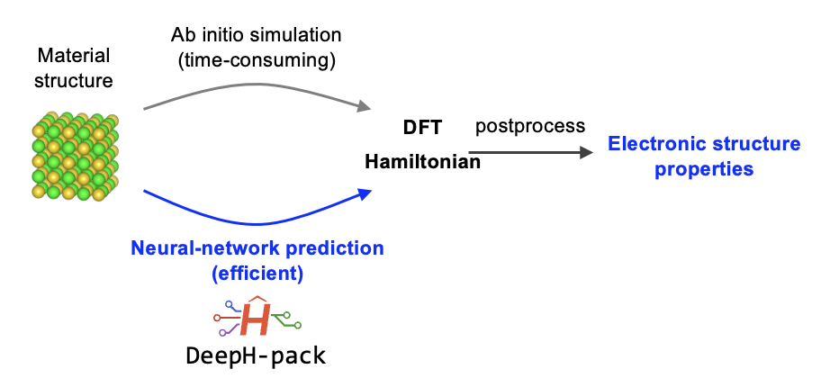

# 1. Theoretical backgrounds

In this part, we give a naive technical overview of DeepH.

## 1.1. Deep-learning Hamiltonian method (DeepH)

Deep-learning Hamiltonian method, [originally proposed in 2021](https://arxiv.org/abs/2104.03786), is widely recognized as one of the leading packages in deep-learning electronic Hamiltonians. Although designated to model electronic Hamiltonians in solid-state systems, the new version of DeepH-pack also achieves high accuracy in modeling electronic Hamiltonains (or Fock matrix) in molecular systems. After nearly five years of development, DeepH has seen vast in-depth advancements, which could be roughly characterized into three categories:

1. **Architecture advancements**

    - Original framework [Nat. Comput. Sci. 2022](https://www.nature.com/articles/s43588-022-00265-6)
    - Integrating equivariant neural network [Nat. Commun. 2023](https://www.nature.com/articles/s41467-023-38468-8)
    - Incorporating eSCN tensor product [arXiv 2024](https://arxiv.org/abs/2401.17015)
    - Incorporating the spirit of unsupervised learning [PRL 2024](link.aps.org/doi/10.1103/PhysRevLett.133.076401)

2. **Improved compatibility with first-principles codes**

    - Compatibility with plane-wave DFT [Nat. Comput. Sci. 2024](https://www.nature.com/articles/s43588-024-00701-9)
    - Extension to hybrid DFT [Nat. Commun. 2024](https://www.nature.com/articles/s41467-024-53028-4)

3. **Exploration of application scenarios**

    - Dealing with magnetism with extended DeepH [Nat. Comput. Sci. 2023](https://www.nature.com/articles/s43588-023-00424-3)
    - Investigating density functional perturbation theory, such as electron-phonon coupling [PRL 2024](https://journals.aps.org/prl/abstract/10.1103/PhysRevLett.132.096401)
    - Developing a "large materials model", a universal model for electronic structures [Sci. Bull. 2024](https://www.sciencedirect.com/science/article/pii/S2095927324004079)

An upcoming Review entitled **Deep-learning electronic structure calculations**, is in press, from which readers may refer to for a comprehensive overview of **deep-learning electronic structures**.

It's worth emphasizing that, despite lasting development, DeepH is still in its primary stage, especially in terms of applications. We're currently exploring several exciting DeepH application scenarios, with some of the results may come up lately.

## 1.2. Deep-learning electronic structures with DeepH

A naive illustration of DeepH workflow is demonstrated as follows:

The core concept is as follows: Instead of modeling electronic structure properties such as band gap, electric conductivity, etc. directly, we use DeepH to model the DFT Hamiltonian. Although the requirement for postprocessing introduces additional burden to the workflow, the advantages of modeling Hamiltonian is apparent, to name a few:

- DFT Hamiltonian includes *all* electronic structure at mean-field level, therefore in principle all mean-field electronic structures could be derived with a single model.
- DFT Hamiltonian contains abundant underlying data, therefore favorable for data-hungry deep-learning methods.
- Through representation under atomic bases, DFT Hamiltonian is compatible to several physical priors inspiring physics-informed design of DeepH.

In terms of physical priors of DFT Hamiltonians, we first emphasize that DFT Hamiltonians may be represented under non-orthogonal localized basis sets. The basis function may be denoted:

$$\phi_{Iplm}(\textbf{r}-\textbf{R}_I)=R_{Ipl}(|\textbf{r}-\textbf{R}_I|)Y_{lm}(\widehat{\textbf{r}-\textbf{R}_I})$$

Here, the basis centered at atom $I$ is indexed by three other indices, multiplicity index $p$, angular quantum number $l$, and magnetic quantum number $m$. The basis value at $\textbf{r}$ is determined by its relative position to nucleus $\textbf{R}_I$, and is the product of a radial function and a spherical harmonics.

Below we introduce abbreviated notation $\alpha\equiv(plm)$. The DFT Hamiltonian matrix elements under localized basis can be formally written as:

$$H_{I\alpha J\beta}=\langle\phi_{I\alpha}|\hat{H}|\phi_{J\beta}\rangle$$

From this definition, two properties of Hamiltonian under this definition will be apparent:

- Sparsity: since atomic-like basis have a decaying radia part, $H_{I\alpha J\beta}$ vanishes for far-away atom pairs $I,J$
- Equivariance (Covariance): Upon spatial rotation, the radial part of basis functions are unchanged, while the spherical harmonics part transform under a certain rule. Therefore we have a mathematical foundation for understanding how $H_{I\alpha J\beta}$ transforms under spatial rotation, thereby capable of expressing equivariance (covariance).

In addition, since Hamiltonians are expressed under localized bases, from Walter Kohn's "nearsightedness principle", certain matrix elements could be largely decided by the atomic structure in its vicinity, enabling the $O(N)$-scaling prediction with DeepH.

Although we briefly discuss the physical priors of DFT Hamiltonians under atomic bases, realizing it in deep-learning is non-trivial, and we recommend readers refer to the above references for more detailed discussions.

In summary, in a typical DeepH study, the streamlined workflow is as follows:

1. Generate a dataset with Electronic Hamiltonians (**Section 3** of the present tutorial)
2. Train DeepH model (**Section 4**)
3. Perform inference with DeepH (**Section 5**)
4. Perform post-processing (task-dependent, but a simple example will be available in section 5)

