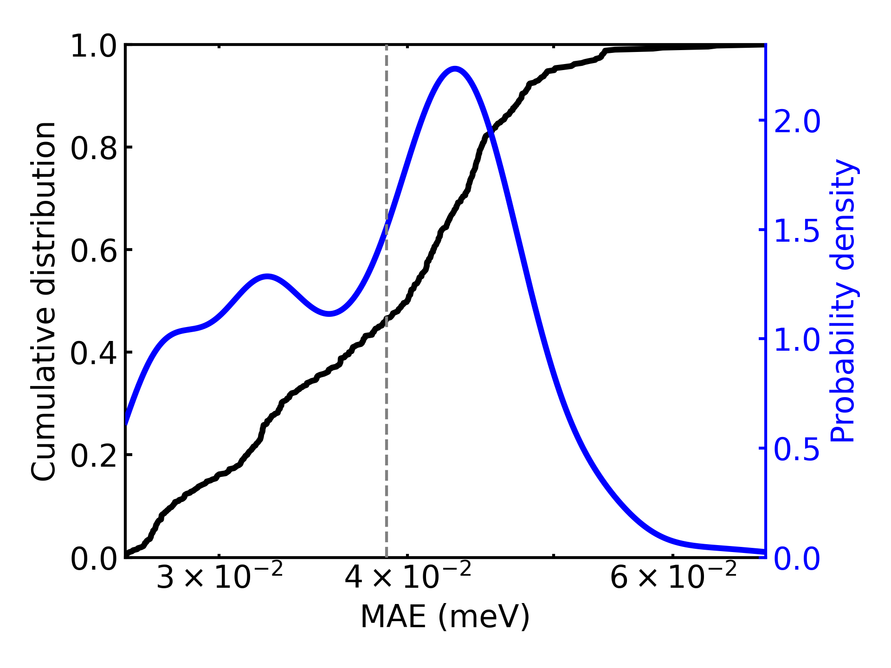
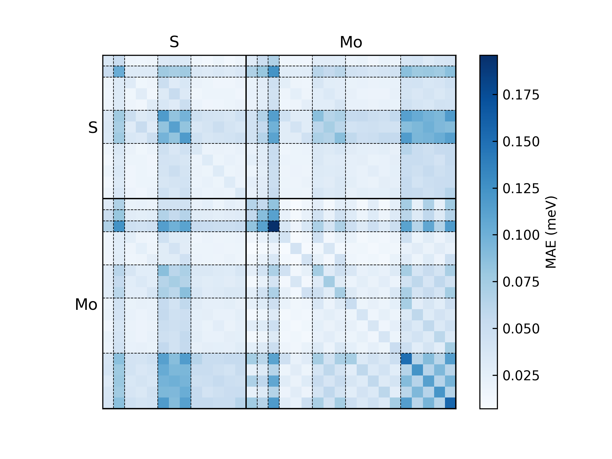
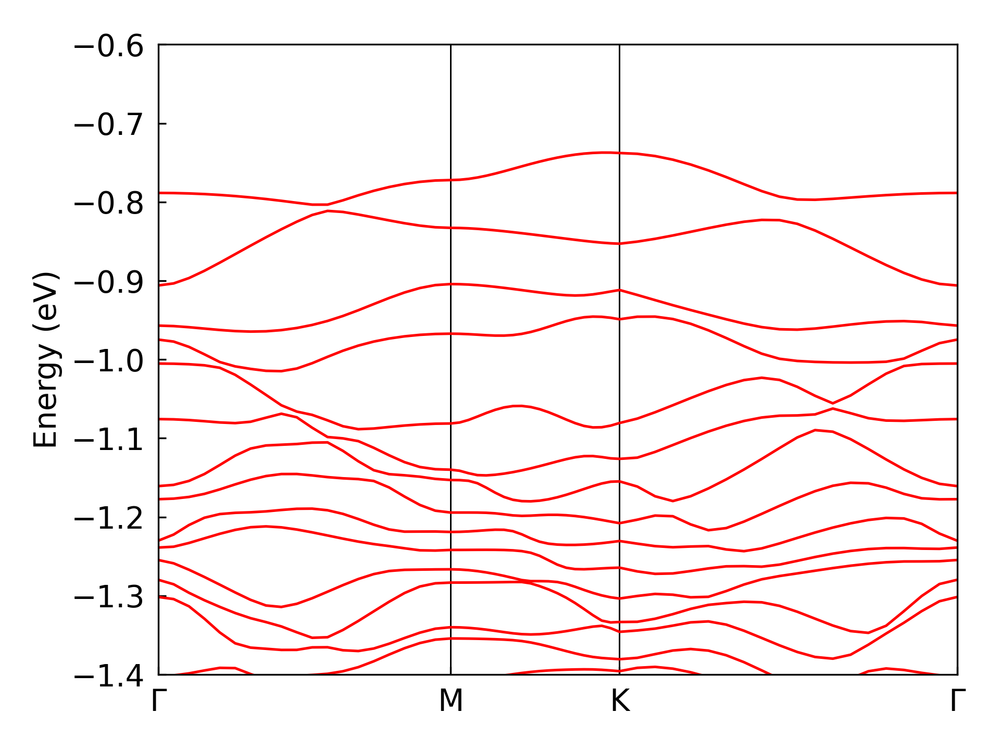
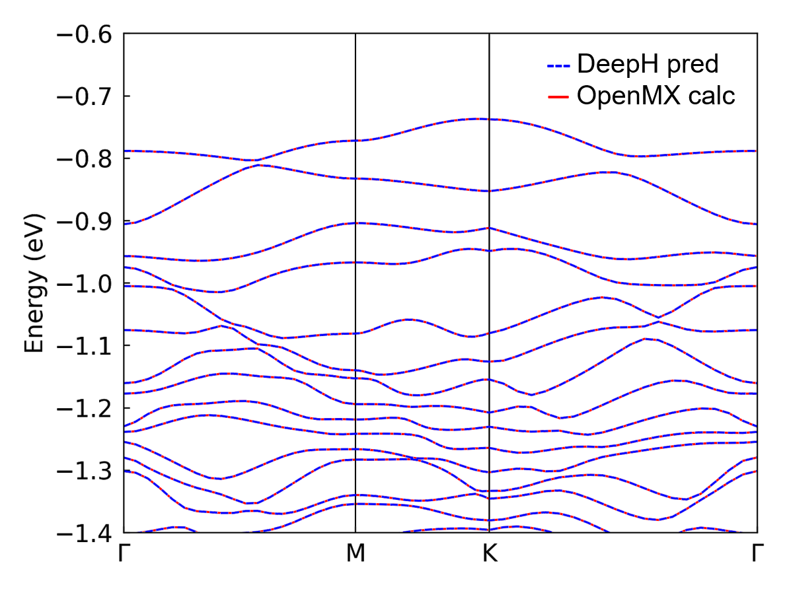

# 5. Inference with DeepH

In this part, we demonstrate several quick examples for DeepH inference. The ability of electronic structure inference on ultra-large systems is the very purpose of DeepH-pack. After training on small systems with relatively small computation amount, the neural-network models can generalize to larger systems with both high accuracy and efficiency.

**NOTE:** This chapter should be done in the `deeph` environment.


## 5.1. Prepare the Dataset for Inference
In the inference process, the hamiltonian matrix is not pre-known and the overlap matrix is a necessary input. The sparsity pattern of the overlap matrix is indispensable for constructing the atomic connectivity graph during inference. The data required by the inference process are listed as follows, and the key point is obtaining the overlap matrix.

```bash
dft
  |- 0
     |- POSCAR
     |- info.json
     |- overlap.h5
  |- 1
  |- ...
```

**NOTE:**

- Although the specific values of overlap matrix do not affect the behavior of the neural network model, the actual numerical values become essential for post-processes such as diagonalization to get band structures. In other words, the calculation of overlap matrix is *always* needed for the whole work-flow.
- In most of the *ab initio* programs based on localized orbitals, the overlap matrix can be efficiently calculated by a single non-self-consistent calculation without executing costly SCF cycles or diagonalization. So that the overlap generation process does not affect the overall $O(N)$ time-cost of the inference work-flow of DeepH-pack.

### 5.1.1 OpenMX
There is no built-in option to perform an overlap-only calculation by OpenMX, so that one needs to modify the OpenMX source code. Please refer to the [overlap-only-OpenMX](https://github.com/mzjb/overlap-only-OpenMX) repository for details. This modified verson of OpenMX will exit after dumping the overlap-matrix. Then the dumped overlap matrix (in the old data format of DeepH) can be converted to the new data format by [DeepH-dock](3.Interface.md).

### 5.1.2 ABACUS
To perform an overlap-only calculation by ABACUS, `calculation get_S` should be specified in the `INPUT` file instead of `calculation scf`, and no further modification of the source code is needed. The program will exit after dumping the `SR.csr` file, and it can be converted to the new data format by [DeepH-dock](3.Interface.md).

### 5.1.3 FHI-aims
By setting `sc_iter_limit = 0` in FHI-aims, users can perform a single-step non-self-consistent calculation that extracts the overlap matrix, while maintaining the fundamental capability that DeepH inference itself requires only `POSCAR` and `info.json` to predict Hamiltonians – with DFT-level computations remaining strictly optional for result verification.

## 5.2. Inference with DeepH
The inference process can be performed on CPU or GPU platforms. Although GPU platform is much faster, the memory (e.g., 24GB for NVIDIA 4090 GPUs) is not enough for large systems (e.g., 10000 atoms in the unitcell). So that CPU platform is more commonly used for inference.

The inference setup contains three essential components:

- TOML configuration file
- `inputs/` directory (containing the POSCAR, info.json, and overlap.h5)
- `model/` directory (containing the optimized model parameters)

### 5.2.1 FHI-aims $\text{H}_2\text{O}$
For the $\text{H}_2\text{O}$ system we just trained in the [previous chapter](4.Training.md), we can use the following configuration file for inference. 
The `./inputs/dft` directory is already linked to the dataset used for training.


```toml
# ---------------------------------- SYSTEM ----------------------------------
[system]
note = "Enjoy DeepH-pack! ;-)"
device = "gpu*1"
float_type = "fp32"
random_seed = 137
log_level = "info"
jax_memory_preallocate = true


# ----------------------------------- DATA ------------------------------------
[data]
inputs_dir = "./inputs"
outputs_dir = "./outputs"

[data.dft]
data_dir_depth = 0
validation_check = false

[data.graph]
dataset_name = "H2O_5K_FHI-aims"
graph_type = "S"
storage_type = "memory"
parallel_num = -1
only_save_graph = false


# ----------------------------- MODEL -----------------------------------------
[model]
model_dir = "../../4.Training/H2O_5K_FHI-aims/outputs/2025-10-14_10-34-43/model"
load_model_type = "best"
load_model_epoch = -1


# ------------------------------ PROCESS --------------------------------------
[process.infer]
output_type = "h5"
output_into = "to_output"
target_symmetrize = true
multi_way_jit_num = 1

[process.infer.dataloader]
batch_size = 1000
```

**NOTE:** 

- The `model.model_dir` is the directory where the model is saved during training, both the relative and absolute path are supported. The directory should end with "model". The `model.load_model_type` selects the "latest.pytree" or "best.pytree" under the model_dir.
- The `process.infer.output_into` controls the location of the output hamiltonians, "to_output" for `data.outputs_dir.dft` and "to_input" for `data.inputs_dir.dft`. 

To execute the inference process on the supercomputing platforms with job management system like `slurm`, it is recommend to write a script and then submit the inference job. 

```bash
#!/bin/bash
#
#SBATCH --job-name=H2O-infer
#SBATCH --gpus=1
#SBATCH -p vip_gpu_sczc641

module load cuda/12.9
source ~/.uvenv/deeph/bin/activate

deeph-infer infer-memory-gpu.toml
```

The configuration file and submit script are already placed under the "H2O_5K_FHI-aims" folder, and one can execute the inference process by one command:

```bash
sbatch submit.sh
```

The inference results will subsequently be written to the outputs (or inputs) directory as `hamiltonian_pred.h5`.

```bash
infer-outputs/<timestamp>
  |- deepx.log
  |- dft
    |- 0
       |- hamiltonian_pred.h5
    |- 1
       |- hamiltonian_pred.h5
    |- ...
```

The water-related training and inference examples provided earlier serve primarily as simplified demonstrations to showcase DeepH's potential in realistic scientific applications.

### 5.2.2 OpenMX $\text{MoS}_2$
For comprehensive research implementation, we present a full-scale $\text{MoS}_2$ dataset which is originally provided by [DeepH-E3](https://www.nature.com/articles/s41467-023-38468-8). Due to the substantial computational requirements for training this model (1-2 days of GPU-intensive training), we cannot practically demonstrate the complete training process in this tutorial. However, we provide the fully trained, converged model parameters for community experimentation and inference tasks.

The `eagle` net is used for this example. Taking an advanced architecture, the model achieves remarkable Hamiltonian prediction accuracy with a mean absolute error (MAE) of 41 $\mu\text{eV}$.

The configuration file for $\text{MoS}_2$ model inference is provided below.

``` toml
# ---------------------------------- SYSTEM ----------------------------------
[system]
note = "Enjoy DeepH-pack! ;-)"
device = "gpu*1"
float_type = "fp32"
random_seed = 137
log_level = "info"
jax_memory_preallocate = true


# ----------------------------------- DATA ------------------------------------
[data]
inputs_dir = "./inputs"
outputs_dir = "./outputs"

[data.dft]
data_dir_depth = 0
validation_check = false

[data.graph]
dataset_name = "MoS2_500_OpenMX"
graph_type = "S"
storage_type = "memory"
parallel_num = -1
only_save_graph = false


# ----------------------------- MODEL -----------------------------------------
[model]
model_dir = "./outputs_previous_train/2025-11-08_07-38-37/model"
load_model_type = "best"
load_model_epoch = -1


# ------------------------------ PROCESS --------------------------------------
[process.infer]
output_type = "h5"
output_into = "to_output"
target_symmetrize = true
multi_way_jit_num = 1

[process.infer.dataloader]
batch_size = 30
```

**NOTE:** The memory usage of inference process is much smaller than the training process. In this tutorial, the inference is performed on the structures with the same size of training structures, so that the `process.infer.dataloader.batch_size` can be much larger than the training batch size.

### 5.2.3 ABACUS Graphene
To demonstrate the ability of DeepH-pack to work with various first-principle programs, we present a monolayer Graphene dataset calculated by ABACUS. The `sparrow` net, a lightweight architecture for efficient modeling of simple systems, is used and achieves an accuracy of 82 $\mu\text{eV}$ MAE after only 9 hours training. 

The configuration file of inference is almost the same with $\text{MoS}_2$ above. Only the graph name and the paths need to be modified, and the settings of the model is automatically read in from the `model.model_dir`, which is quite user-friendly.

---

These examples demonstrate DeepH's capability to transform massive quantum material datasets into compact, high-precision computational models. Both the `sparrow` and `eagle` net perform well on the datasets generated by a variety of DFT softwares. The `sparrow` net acheives high accuracy with low computation overhead, and the `eagle` net acheives even higher accuracy (50% to 100% improvement upon sparrow net) with an acceptable trade-off in efficiency (approximately 50% slower than sparrow net). This allows users to select the most suitable network settings based on their specific purposes. 


## 5.3. Error Analyzation
To confirm the validity of the model, the inference result `hamiltonian_pred.h5` is compared with the benchmark data `hamiltonian.h5`. The error extraction and visualization can be done by the `dock.error.ExposeErrorDist` command in DeepH-dock. It gives detailed error distribution, not just a loss value.

```bash
cd ./outputs/<timestamp>
dock.error.ExposeErrorDist dft -b ../../inputs/dft -k structure -p 5
```
This will generate a figure `error_structure_distribution.png` showing the error distribution of each structure. The result of the $\text{MoS}_2$ example is shown below:



```bash
cd ./outputs/<timestamp>
dock.error.ExposeErrorDist dft -b ../../inputs/dft -k orbital -p 5
```
This will generate a figure `error_orbital_resolute_distribution.png` showing the error decomposed on each orbital-pair. The result of the $\text{MoS}_2$ example is shown below:



Several error modes are available by the `-k` option:

- "orbital": error for each orbital pair.
- "element-pair": error for each element pair.
- "element(-logfile)": error of each element.
- "entries": error for matrix entries with scatter figure.
- "structure(-logfile)": error distribution of each structure.

**NOTE:**

- The raw data (not just the figure) can be dumped by `--cache_res` option.
- Use `--data_split_json` and related options to select a subset for error statistics.


## 5.4. Determine and update the Fermi energy

After obtaining the predicted Hamiltonian (by default named as `hamiltonian_pred.h5`) through the inferencing process, you can diagonalize it and plot the corresponding band structures with the help of `DeepH-dock`, facilitating subsequent analysis and comparison.

In DeepH, Hamiltonians differing only by an energy shift gauge transformation ($H' = H - \mu S$) are considered equivalent. DeepH predictions do not guarantee gauge invariance, particularly when training datasets contain structures with significantly divergent gauge choices. Under such conditions, re-evaluating the Fermi energy based on electron occupation numbers becomes essential. The `deeph-dock` toolkit provides specialized utilities for this purpose. Users must first prepare the following four prerequisite files:
```bash
cd MoS2_500_OpenMX/band/502
ln -s ../../outputs/<timestamp>/dft/502/hamiltonian_pred.h5 ./hamiltonian.h5
```

Where the `<timestamp>` is your inference time_stamp. The current directory looks like below:
```bash
band/502/
    |- POSCAR
    |- info.json
    |- overlap.h5
    |- hamiltonian.h5 -> ../../outputs/<timestamp>/dft/502/hamiltonian_pred.h5
```

Subsequently, the total valence electron count must be provided under the "occupation" key in `info.json`. It is usually included in the output file of the program, otherwise it can be calculated using the pesudo-potential information. Take $\text{Mo}_{25}\text{S}_{50}$ for example, for OpenMX with PBE19 pesudopotential, the occupation is the sum of the valence electrons, i.e., $14\times 25 + 6\times 50=650$, and for FHI-aims which is an all-electron program, the occupation is the sum of the atomic numbers, i.e.,  precisely $42\times 25 + 16\times 50 = 1,850$.

```json
{
  "occupation": 650, # OpenMX with PBE19 pesudopotential
  "atoms_quantity": 75,
  "orbits_quantity": 1125,
  "orthogonal_basis": false,
  "spinful": false,
  "fermi_energy_eV": 0.0,
  "elements_orbital_map": {"Mo": [0, 0, 0, 1, 1, 2, 2], "S": [0, 0, 1, 1, 2]}
}
```

**NOTE:** The occupation here always includes spin degeneracy, and the program automatically deals with the spin-degeneracy when `spinful` is false. For the spinless case above, it will give $650\div 2 = 325$ occupied bands.

Subsequently, simply execute the following command within the data directory to compute the Fermi energy.

```bash
cd band/502
dock.dos.FindFermi -p 5 .
```

The calculated Fermi energy will be stored in `fermi_energy.json`. 

```json
{"fermi_energy_eV": -4.966581910156199}
```
Use this value to repalace the "fermi_energy_eV" in `info.json` and you are ready to run the band structure calculation.

**NOTE:** Users may notice that automatic Fermi level updating is intentionally unavailable in this implementation. This design choice stems from two core principles: 

- Preserving raw data integrity is paramount in neural network training, as modifying source datasets carries inherent risks – we therefore implement deliberate barriers against accidental misuse.
- We encourage users to implement simple functionalities through Python scripting, analogous to creating Bash scripts for data extraction. DeepH-pack prioritizes providing a flexible computational framework over delivering an all-in-one black-box program.


## 5.5. Plotting energy bands

In order to obtain the band structures, an additional file `K_PATH` is required during the band structure calculation. This file specifies the high-symmetry path for the band structure and can be written manually. For layered $\text{MoS}_2$ the path can be:

```bash
20  0.000000 0.000000 0.000000  0.000000 0.500000 0.000000  Gamma M
20  0.000000 0.500000 0.000000  0.333333 0.333333 0.000000  M K
20  0.333333 0.333333 0.000000  0.000000 0.000000 0.000000  K Gamma  
```

With each line contains: k-point count, fractional coordinates of the first and second high-symmetry points, followed by their labels.

```bash
band/502/
    |- POSCAR
    |- info.json
    |- overlap.h5
    |- hamiltonian.h5 -> ../../outputs/<timestamp>/dft/502/hamiltonian_pred.h5
    |- K_PATH
```

Finally, you can use the following command to obtain the band structure plot:

``` bash
cd band/502
dock.band.CalcData -p 5 .
```

The `-p 5` specifies 5-core parallelization over k points and can be adjusted according to available computational resources.

After obtaining the band file `band.h5`, you can plot the band structure with the following command:

``` bash
dock.band.PlotPNG --min <Emin> --max <Emax> .
```

where `Emin` and `Emax` set the energy bounds for the band structure plot. The obtained band structure plot is shown in the figure below:




### 5.5.1 Comparision with benchmark data
If the data calculated by the first-principle softwares is available, the band structure from the first-principle calculation and DeepH-pack inference can be combined together for comparison. The comparison plot of a $\text{MoS}_2$ structure is shown below:




## 5.6. DeepH-Accelerated Self-Consistent Calculations

As demonstrated above, the Hamiltonians predicted by DeepH are significantly superior to the initial guess Hamiltonians inside the *ab-initio* softwares. By feeding DeepH-predicted Hamiltonians back into the software as restart guesses for continued calculations, the number of SCF iteration steps required for convergence can be dramatically reduced. The corresponding data pipeline is currently under development and will soon be released in the `deeph-dock` toolkit.
