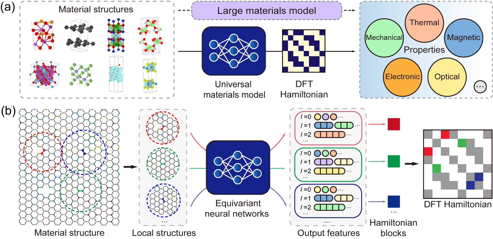

# 6. Universal Material Model Odyssey

Finally, in this part, we reach the most exciting aspect of DeepH: the Universal Materials Model (UMM). A practical demonstration using the $\text{MoS}_{2}$ dataset is provided to showcase the model's capabilities.


## 6.1 What is DeepH-UMM?
DeepH-UMM (Deep Learning DFT Hamiltonian Universal Material Model) represents a significant advancement in computational materials science. It is a universal, deep learning-based model designed to predict the electronic structures of diverse materials. Crucially, its applicability extends to any material composed of elements within the Periodic Table.

The core strength of DeepH-UMM lies in its training process. It leverages an extensive and diverse dataset encompassing a vast array of known materials. This comprehensive training enables the model to learn the intricate, underlying physical relationships that govern how a material's atomic composition and structure determine its electronic properties. By capturing these fundamental principles, DeepH-UMM demonstrates remarkable generalization capability. It can accurately predict the electronic structures of novel, previously unseen materials, effectively bypassing the need for explicit first-principles calculations for each new compound.

In essence, DeepH-UMM serves as a powerful computational tool that bridges the gap between material composition and electronic behavior, accelerating the discovery and understanding of new functional materials.


*The early-stage proof-of-concept version of DeepH-UMM.*

*Yuxiang Wang\*, Yang Li\*, Zechen Tang\*, et.al. Science Bulletin 69, 2514 (2024)*


## 6.2 One-shot inference with universal materials model
DeepH-UMM enables direct property prediction for target materials without dataset-specific retraining. Its operational workflow is identical to conventional specialized models. As highlighted by Prof. Yong Xu in his report:
> "We trained a universal model on 2 million materials, achieving sub-meV level accuracy. This model demonstrates exceptional performance across elements in the first six rows of the periodic table, with related publications in preparation."

That model was trained on a massive dataset comprising trillions of Hamiltonian matrix entries, with the training set of graph-structured data files reaching a scale of hundreds of terabytes.

This tutorial provides a *restricted UMM* variant trained on 20 thousand materials covering 63 common elements (Periodic Table Rows 1 to 6). This restricted UMM also demonstrates robust predictive capability for any material within the covered elemental space, achieving *ab init* accuracy (mean absolute error of Hamiltonian entries ~ 1.3 meV) as rigorously validated.

Execute the following command to initiate the large model inference process. The procedures for dataset preparation and model loading remain identical to those detailed in [Chapter 5](./5.Inference.md).
```bash
cd ~/workshop/6.UMM_Odyssey/1.Do_Inference
sbatch submit.sh
```

In this demonstration, we will perform inference on 100 $\text{MoS}_2$ crystal structures. The corresponding inference configuration in TOML format is shown below:
```toml
# ---------------------------------- SYSTEM ----------------------------------
[system]
note = "Adventure of DeepH-UMM :/"
device = "gpu*1"
float_type = "fp32"
random_seed = 137
log_level = "info"
jax_memory_preallocate = true

# ----------------------------------- DATA ------------------------------------
[data]
inputs_dir = "./inputs"
outputs_dir = "./outputs"

[data.dft]
data_dir_depth = 0
validation_check = false

[data.graph]
dataset_name = "MoS2_100_OpenMX"
graph_type = "S"
storage_type = "memory"
parallel_num = -1
only_save_graph = false


# ----------------------------- MODEL -----------------------------------------
[model]
model_dir = "../_.DeepH-UMM.D20k-P48M/model"
load_model_type = "best"
load_model_epoch = -1


# ------------------------------ PROCESS --------------------------------------
[process.infer]
output_type = "h5"
output_into = "to_output"
target_symmetrize = true
multi_way_jit_num = 1

[process.infer.dataloader]
batch_size = 10
```

The inference results are saved in the `outputs/<timestamp>` directory. The following command can be used to visualize the prediction error distribution:
```bash
cd ~/workshop/6.UMM_Odyssey/1.Do_Inference/outputs/<timestamp>
dock.error.ExposeErrorDist dft -b ../../inputs/dft --task structure -p 2
```

**NOTE:** On supercomputing platforms, **it is strongly discouraged** to execute any heavy computational tasks directly on login nodes. Experienced users should instead dispatch commands to compute nodes by submitting job scripts.

The Hamiltonian MAE between the prediction of UMM and the benchmark data is $1.44\text{meV}$, which is close to the loss on the original test set ($1.29\text{meV}$). The universal material model provides a reliable one-shot prediction on a wide range of materials, which is convenient for users because no training process is needed.


## 6.3. Fine-tune universal materials model
Recalling the training and inference workflows established in Chapters [4](./4.Training.md) and [5](./5.Inference.md), you may note that DeepH-UMM's current accuracy on specialized material systems requires improvement. When trained on dedicated datasets, DeepH models typically achieve Hamiltonian prediction precision within hundreds of μeV after days of training. However, the Universal Materials Model (UMM) in our current tutorial maintains accuracy around 1.0 meV.

This performance gap is scientifically justified:

- UMM handles significantly more complex spatial structures.
- The 20,000-material training set remains insufficient for capturing intricate physical interactions.

Notably, we can enhance this relatively coarse model's precision on target datasets through fine-tuning techniques. Compared to specialized models trained from scratch, fine-tuning delivers:

- ✓ Accelerated convergence (1-2 epochs for significant improvement over one-shot prediction) 
- ✓ Competitive accuracy with dozens of epochs (vs. hundreds/thousands for full training) 
- ✓ Resource efficiency in computational cost 

DeepH-pack Light version currently supports full-parameter fine-tuning (transfer learning mode), but does not implement parameter-efficient methods such as LoRA. To initiate fine-tuning, execute:

```bash
cd ~/workshop/6.UMM_Odyssey/2.Lets_Finetune_It
sbatch submit.sh
```

The fine-tuning configuration in TOML format is shown below. We utilize the resume module to support fine-tuning tasks.

Set `process.train.continued.previous_output_dir` to the UMM directory in your own path. You can obtain this path using:
```bash
cd ~/workshop/6.UMM_Odyssey/_.DeepH-UMM.D20k-P48M
pwd
> /data/run01/sczp0034/share/workshop/6.UMM_Odyssey/_.DeepH-UMM.D20k-P48M
# Set process.train.continued.previous_output_dir to ^^^^^^^^^
```

```toml
# ---------------------------------- SYSTEM ----------------------------------
[system]
note = ""
device = "gpu*1"
float_type = "fp32"
random_seed = 137
log_level = "info"
jax_memory_preallocate = true
show_train_process_bar = false

# ----------------------------------- DATA ------------------------------------
[data]
inputs_dir = "./inputs"
outputs_dir = "./outputs"

[data.dft]
data_dir_depth = 0
validation_check = false

[data.graph]
dataset_name = "MoTe2_100_OpenMX"
graph_type = "HS"
storage_type = "memory"
common_orbital_types = ""
parallel_num = -1
only_save_graph = false

[data.model_save]
best = true
latest = true
latest_interval = 5
latest_num = 1

# ----------------------------- MODEL -----------------------------------------
[model]
net_type = "eagle"
target_type = "H"
loss_type = "mae"

[model.advanced]
gaussian_basis_rmax = 7.5
net_irreps = "96x0e+96x1e+80x2e+40x3e+20x4e+8x5e"
num_blocks = 6
num_heads = 2
enable_bs3b_layer = true
bs3b_orbital_types = "s15p12d7"
consider_parity = false
standardize_gauge = true

# ------------------------------ PROCESS --------------------------------------
[process.train]
max_epoch = 1000

multi_way_jit_num = 1
ahead_of_time_compile = true
do_remat = false

[process.train.dataloader]
batch_size = 1

train_size = 80
validate_size = 10
test_size = 10
dateset_split_json = ""
only_use_train_loss = false

[process.train.drop]
dropout_rate = 0.0
stochastic_depth = 0.00
proj_rate = 0.0

[process.train.optimizer]
type = "adamw"
init_learning_rate = 3E-4
clip_norm_factor = -1.0
betas = [0.9, 0.999]
weight = 0.001
eps = 1E-8

[process.train.scheduler]
min_learning_rate_scale = 1.01E-3
type = "warmup_cosine_decay"
init_scale = 0.1
warmup_steps = 1200
decay_steps = 24000
end_scale = 1E-3

[process.train.continued]
enable = true
new_training_data = true
new_optimizer = true
previous_output_dir = "\\Add DeepH-UMM Training Outputs Path Here//"
load_model_type = "best"
load_model_epoch = -1
```

The log file is shown below.
```text
[ 11.20-22:00:45 ]
[ 11.20-22:00:45 ]            Welcome to DeepH-pack (deepx)!
[ 11.20-22:00:45 ]                  Version 1.0.6
[ 11.20-22:00:45 ]
[ 11.20-22:00:45 ] ...................................................
[ 11.20-22:00:45 ] ........_____....................._...._.[PACK]....
[ 11.20-22:00:45 ] .......|  __ \...................| |..| |..........
[ 11.20-22:00:45 ] .......| |  | | ___  ___ ._ _ ...| |..| |..........
[ 11.20-22:00:45 ] .......| |  | |/ _ \/ _ \| '_ \ .|X'><'X|..........
[ 11.20-22:00:45 ] .......| |__| |. __/. __/| |_) |.| |..| |..........
[ 11.20-22:00:45 ] .......|_____/ \___|\___|| .__/ .|_|..|_|..........
[ 11.20-22:00:45 ] .........................| |.......................
[ 11.20-22:00:45 ] .........................|_|.......................
[ 11.20-22:00:45 ] ...................................................
[ 11.20-22:00:45 ]
[ 11.20-22:00:45 ]             Copyright CMT@Phys.Tsinghua
[ 11.20-22:00:45 ]                  Powered by JAX
[ 11.20-22:00:45 ]
[ 11.20-22:00:45 ]
[ 11.20-22:00:45 ] [system] Under the machine `dppa443@gn08493`, with `x86_64 (64 cores)` CPU, and `1007GB` RAM.
[ 11.20-22:00:46 ] [system] Use the GPU device(s) `[0]` of totally `1` device(s). Succeeded test on the head device `cuda:0`!
[ 11.20-22:00:46 ] [system] Totally use `64` CPU cores.
[ 11.20-22:00:46 ] [system] The calculation will be sharding across `Mesh('data': 1, axis_types=(Auto,))`.
[ 11.20-22:00:46 ] [system] Set random stream with seed `137`, type `key<fry>`.
[ 11.20-22:00:46 ] [system] Using the float type `fp32`. The testing results on JAX and PyTorch are `jnp.float32` and `torch.float32`
[ 11.20-22:00:56 ] [graph] Building the graph with type: `train-HS`.
[ 11.20-22:00:56 ] [rawdata] Read in features from json: `/home/dppa443/workshop/6.UMM_Odyssey/2.Lets_Finetune_It/inputs/dft/features.json`.
[ 11.20-22:00:56 ] [graph] Establishing the graph from the DFT raw data: `/home/dppa443/workshop/6.UMM_Odyssey/2.Lets_Finetune_It/inputs/dft`.
[ 11.20-22:00:56 ] [graph] Start processing `100` structures with `32` processes.
[ 11.20-22:01:16 ] [graph] Finish processing `100` structures.
[ 11.20-22:01:23 ] [graph] Saved the graph set in memory to `/home/dppa443/workshop/6.UMM_Odyssey/2.Lets_Finetune_It/inputs/graph/MoTe2_100_Op
[ 11.20-22:01:23 ] [graph] Using the common orbital types: `[0, 0, 0, 1, 1, 2, 2]`
[ 11.20-22:01:23 ] [graph] Split the graph set with batch size: `1`
[ 11.20-22:01:24 ] [dataloader] Train size: `80`. Val size: `10`. Test size: `10`.
[ 11.20-22:01:24 ] [dataloader] Data sharding way: `1`. Batch size: `1`. Number of nodes each batch: `[77]`, `[77]`, `[77]`. Number of edges each batch:
[ 11.20-22:01:24 ] [dataloader] The training dataset encompasses `335046` edges, aggregating a total of `74783913` data entries.
[ 11.20-22:01:24 ] [model] Building the model `eagle-H` with loss `mae`.
[ 11.20-22:01:25 ] [model] Initializing the net parameters with dummy data...
[ 11.20-22:02:38 ] [model] The parameters size is `48079884`.
[ 11.20-22:02:39 ] [optimizer] Using the optimizer `AdamW` with: betas `[0.9, 0.999]`, eps `1e-08`, weight decay strength `0.001`, and initial learning rate `0.0003`.
[ 11.20-22:02:39 ] [optimizer] The global CLIP norm algo factor is NOT USED.
[ 11.20-22:02:39 ] [optimizer] Using the scheduler `WarmupCosineDecay` with: init scale `0.1`, warmup steps `1200`, decay steps `24000`, end scale `0.001`.
[ 11.20-22:02:43 ] [model] We will save the model into `/home/dppa443/workshop/6.UMM_Odyssey/2.Lets_Finetune_It/outputs/2025-11-20_22-00-38/model`. The best model will be saved. The latest model (keep `1` each `5` epoch) will be saved.
[ 11.20-22:02:43 ] [train] JAX networks: Parallel threads AOT-compiling `1` frameworks for training and `1` for validation.
[ 11.20-22:04:32 ] [train] Compile networks done!
[ 11.20-22:04:32 ] [model] We are loading the `best` model inside `/home/dppa443/workshop/6.UMM_Odyssey/_.DeepH-UMM.D20k-P48M`. We are using the new training dataset, and applying new optimizer.
[ 11.20-22:04:33 ] [train] Starting the training process ...
[ 11.20-22:05:59 ] [train] Epoch 1 | Time 72.46 s | Train-Loss 7.733642e-04 | Val-Loss 5.755628e-04 | Scale 0.1600000262260437
[ 11.20-22:06:40 ] [train] Epoch 2 | Time 33.94 s | Train-Loss 5.064172e-04 | Val-Loss 4.295226e-04 | Scale 0.2200000286102295
[ 11.20-22:07:20 ] [train] Epoch 3 | Time 33.21 s | Train-Loss 4.242459e-04 | Val-Loss 3.906064e-04 | Scale 0.2800000309944153
[ 11.20-22:07:59 ] [train] Epoch 4 | Time 34.01 s | Train-Loss 4.072940e-04 | Val-Loss 3.449457e-04 | Scale 0.3399999737739563
[ 11.20-22:08:49 ] [train] Epoch 5 | Time 34.00 s | Train-Loss 4.048322e-04 | Val-Loss 3.347684e-04 | Scale 0.3999999761581421
[ 11.20-22:09:29 ] [train] Epoch 6 | Time 33.97 s | Train-Loss 4.242831e-04 | Val-Loss 3.849993e-04 | Scale 0.4599999785423279
[ 11.20-22:10:08 ] [train] Epoch 7 | Time 34.00 s | Train-Loss 5.183004e-04 | Val-Loss 5.113371e-04 | Scale 0.5199999809265137
[ 11.20-22:10:48 ] [train] Epoch 8 | Time 34.07 s | Train-Loss 5.049233e-04 | Val-Loss 5.360487e-04 | Scale 0.5799999833106995
[ 11.20-22:11:26 ] [train] Epoch 9 | Time 33.30 s | Train-Loss 4.957246e-04 | Val-Loss 5.422708e-04 | Scale 0.6399999856948853
```